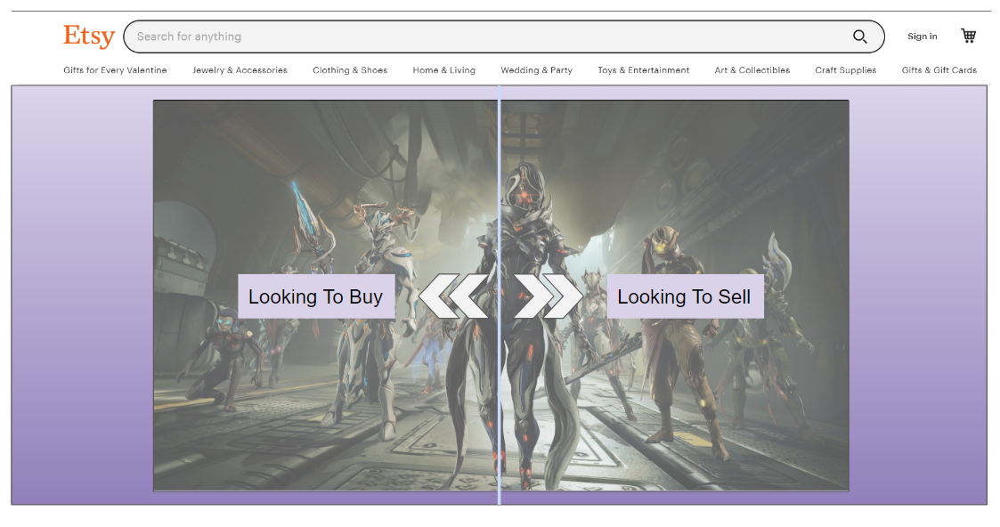

sqc-project-ErrorDeleted
========================

This project will set as a holding point for a databased backed up website. 
This website will let users interact with each others' sellings & buyings. 
The database will hold user info like login, cart holdings (What they are 
selling or what they are buying), and general info about products stats.

Web Service
-----------

[Etsy](https://www.etsy.com/developers/documentation/getting_started/api_basics) API.v3 is the main service that will be used to set up the project.
> * [User](https://developers.etsy.com/documentation/reference#tag/User)
> * [Reference-Includes Cart Info](https://developers.etsy.com/documentation/reference)
> * [Shop](https://developers.etsy.com/documentation/reference#tag/Shop)

Database Use
------------
*Users* | Database would need to read and write profile/account informaion.  
*Items* | Would keep track of item information (basic/scratch)  
*MarketItems* | The database would keep track of all items up for sale. *FK Items*  
*Cart* | The database would hold cart information for each account. *FK Users*  

Initial Designs
--------------

*General view of navigation*

*Idea: Hover over big image and pick your action*
